> 本文为中文翻译版本，内容基于英文版进行，我们欢迎您随时提出修改建议。我们推荐您阅读 [AI 仓库 README](https://github.com/apache/incubator-hugegraph-ai/tree/main/hugegraph-llm#readme) 以获取最新信息，官网会定期同步更新。

> **连接图数据库与大语言模型的桥梁**

> AI 总结项目文档：[](https://deepwiki.com/apache/incubator-hugegraph-ai)

## 🎯 概述

HugeGraph-LLM 是一个功能强大的工具包，它融合了图数据库和大型语言模型的优势，实现了 HugeGraph 与 LLM 之间的无缝集成，助力开发者构建智能应用。

### 核心功能
- 🏗️ **知识图谱构建**：利用 LLM 和 HugeGraph 自动构建知识图谱。
- 🗣️ **自然语言查询**：通过自然语言（Gremlin/Cypher）操作图数据库。
- 🔍 **图增强 RAG**：借助知识图谱提升问答准确性（GraphRAG 和 Graph Agent）。

更多源码文档，请访问我们的 [DeepWiki](https://deepwiki.com/apache/incubator-hugegraph-ai) 页面（推荐）。

## 📋 环境要求

> [!IMPORTANT]
> - **Python**：3.10+（未在 3.12 版本测试）
> - **HugeGraph Server**：1.3+（推荐 1.5+）
> - **UV 包管理器**：0.7+

## 🚀 快速开始

请选择您偏好的部署方式：

### 方案一：Docker Compose（推荐）

这是同时启动 HugeGraph Server 和 RAG 服务的最快方法：

```bash
# 1. 设置环境
cp docker/env.template docker/.env
# 编辑 docker/.env，将 PROJECT_PATH 设置为您的实际项目路径

# 2. 部署服务
cd docker
docker-compose -f docker-compose-network.yml up -d

# 3. 验证部署
docker-compose -f docker-compose-network.yml ps

# 4. 访问服务
# HugeGraph Server: http://localhost:8080
# RAG 服务: http://localhost:8001
```

### 方案二：独立 Docker 容器

如果您希望对各组件进行更精细的控制：

#### 可用镜像
- **`hugegraph/rag`**：开发镜像，可访问源代码
- **`hugegraph/rag-bin`**：生产优化的二进制文件（使用 Nuitka 编译）

```bash
# 1. 创建网络
docker network create -d bridge hugegraph-net

# 2. 启动 HugeGraph Server
docker run -itd --name=server -p 8080:8080 --network hugegraph-net hugegraph/hugegraph

# 3. 启动 RAG 服务
docker pull hugegraph/rag:latest
docker run -itd --name rag \
  -v /path/to/your/hugegraph-llm/.env:/home/work/hugegraph-llm/.env \
  -p 8001:8001 --network hugegraph-net hugegraph/rag

# 4. 监控日志
docker logs -f rag
```

### 方案三：从源码构建

适用于开发和自定义场景：

```bash
# 1. 启动 HugeGraph Server
docker run -itd --name=server -p 8080:8080 hugegraph/hugegraph

# 2. 安装 UV 包管理器
curl -LsSf https://astral.sh/uv/install.sh | sh

# 3. 克隆并设置项目
git clone https://github.com/apache/incubator-hugegraph-ai.git
cd incubator-hugegraph-ai/hugegraph-llm

# 4. 创建虚拟环境并安装依赖
uv venv && source .venv/bin/activate
uv pip install -e .

# 5. 启动 RAG 演示
python -m hugegraph_llm.demo.rag_demo.app
# 访问: http://127.0.0.1:8001

# 6. (可选) 自定义主机/端口
python -m hugegraph_llm.demo.rag_demo.app --host 127.0.0.1 --port 18001
```

#### 额外设置（可选）

```bash
# 下载 NLTK 停用词以优化文本处理
python ./hugegraph_llm/operators/common_op/nltk_helper.py

# 更新配置文件
python -m hugegraph_llm.config.generate --update
```

> [!TIP]
> 查看我们的[快速入门指南](https://github.com/apache/incubator-hugegraph-ai/blob/main/hugegraph-llm/quick_start.md)获取详细用法示例和查询逻辑解释。

## 💡 用法示例

### 知识图谱构建

#### 交互式 Web 界面

使用 Gradio 界面进行可视化知识图谱构建：

**输入选项：**
- **文本**：直接输入文本用于 RAG 索引创建
- **文件**：上传 TXT 或 DOCX 文件（支持多选）

**Schema 配置：**
- **自定义 Schema**：遵循我们[模板](https://github.com/apache/incubator-hugegraph-ai/blob/aff3bbe25fa91c3414947a196131be812c20ef11/hugegraph-llm/src/hugegraph_llm/config/config_data.py#L125)的 JSON 格式
- **HugeGraph Schema**：使用现有图实例的 Schema（例如，“hugegraph”）


#### 代码构建

使用 `KgBuilder` 类通过代码构建知识图谱：

```python
from hugegraph_llm.models.llms.init_llm import LLMs
from hugegraph_llm.operators.kg_construction_task import KgBuilder

# 初始化并链式操作
TEXT = "在此处输入您的文本内容..."
builder = KgBuilder(LLMs().get_chat_llm())

(
    builder
    .import_schema(from_hugegraph="talent_graph").print_result()
    .chunk_split(TEXT).print_result()
    .extract_info(extract_type="property_graph").print_result()
    .commit_to_hugegraph()
    .run()
)
```

**工作流：**

```mermaid
graph LR
    A[导入 Schema] --> B[文本分块]
    B --> C[提取信息]
    C --> D[提交到 HugeGraph]
    D --> E[执行工作流]
    
    style A fill:#fff2cc
    style B fill:#d5e8d4
    style C fill:#dae8fc
    style D fill:#f8cecc
    style E fill:#e1d5e7
```


### 图增强 RAG

利用 HugeGraph 进行检索增强生成：

```python
from hugegraph_llm.operators.graph_rag_task import RAGPipeline

# 初始化 RAG 工作流
graph_rag = RAGPipeline()

# 执行 RAG 工作流
(
    graph_rag
    .extract_keywords(text="给我讲讲 Al Pacino 的故事。")
    .keywords_to_vid()
    .query_graphdb(max_deep=2, max_graph_items=30)
    .merge_dedup_rerank()
    .synthesize_answer(vector_only_answer=False, graph_only_answer=True)
    .run(verbose=True)
)
```

**RAG 工作流：**

```mermaid
graph TD
    A[用户查询] --> B[提取关键词]
    B --> C[匹配图节点]
    C --> D[检索图上下文]
    D --> E[重排序结果]
    E --> F[生成答案]
    
    style A fill:#e3f2fd
    style B fill:#f3e5f5
    style C fill:#e8f5e8
    style D fill:#fff3e0
    style E fill:#fce4ec
    style F fill:#e0f2f1
```


## 🔧 配置

运行演示后,将自动生成配置文件：

- **环境**：`hugegraph-llm/.env`
- **提示**：`hugegraph-llm/src/hugegraph_llm/resources/demo/config_prompt.yaml`

> [!NOTE]
> 使用 Web 界面时，配置更改会自动保存。对于手动更改，刷新页面即可加载更新。

### LLM 提供商配置

本项目使用 [LiteLLM](https://docs.litellm.ai/docs/providers) 实现多提供商 LLM 支持，可统一访问 OpenAI、Anthropic、Google、Cohere 以及 100 多个其他提供商。

#### 方案一：直接 LLM 连接（OpenAI、Ollama）

```bash
# .env 配置
chat_llm_type=openai           # 或 ollama/local
openai_api_key=sk-xxx
openai_api_base=https://api.openai.com/v1
openai_language_model=gpt-4o-mini
openai_max_tokens=4096
```

#### 方案二：LiteLLM 多提供商支持

LiteLLM 作为多个 LLM 提供商的统一代理：

```bash
# .env 配置
chat_llm_type=litellm
extract_llm_type=litellm
text2gql_llm_type=litellm

# LiteLLM 设置
litellm_api_base=http://localhost:4000  # LiteLLM 代理服务器
litellm_api_key=sk-1234                  # LiteLLM API 密钥

# 模型选择（提供商/模型格式）
litellm_language_model=anthropic/claude-3-5-sonnet-20241022
litellm_max_tokens=4096
```

**支持的提供商**：OpenAI、Anthropic、Google（Gemini）、Azure、Cohere、Bedrock、Vertex AI、Hugging Face 等。

完整提供商列表和配置详情，请访问 [LiteLLM Providers](https://docs.litellm.ai/docs/providers)。

### Reranker 配置

Reranker 通过重新排序检索结果来提高 RAG 准确性。支持的提供商：

```bash
# Cohere Reranker
reranker_type=cohere
cohere_api_key=your-cohere-key
cohere_rerank_model=rerank-english-v3.0

# SiliconFlow Reranker
reranker_type=siliconflow
siliconflow_api_key=your-siliconflow-key
siliconflow_rerank_model=BAAI/bge-reranker-v2-m3
```

### Text2Gremlin 配置

将自然语言转换为 Gremlin 查询：

```python
from hugegraph_llm.operators.graph_rag_task import Text2GremlinPipeline

# 初始化工作流
text2gremlin = Text2GremlinPipeline()

# 生成 Gremlin 查询
result = (
    text2gremlin
    .query_to_gremlin(query="查找所有由 Francis Ford Coppola 执导的电影")
    .execute_gremlin_query()
    .run()
)
```

**REST API 端点**：有关 HTTP 端点详情，请参阅 [REST API 文档](./rest-api.md)。

## 📚 其他资源

- **图可视化**：使用 [HugeGraph Hubble](https://hub.docker.com/r/hugegraph/hubble) 进行数据分析和 Schema 管理
- **API 文档**：浏览我们的 REST API 端点以进行集成
- **社区**：加入我们的讨论并为项目做出贡献

---

**许可证**：Apache License 2.0 | **社区**：[Apache HugeGraph](https://hugegraph.apache.org/)
