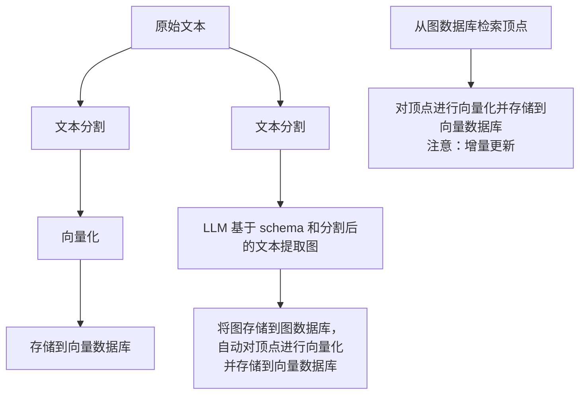
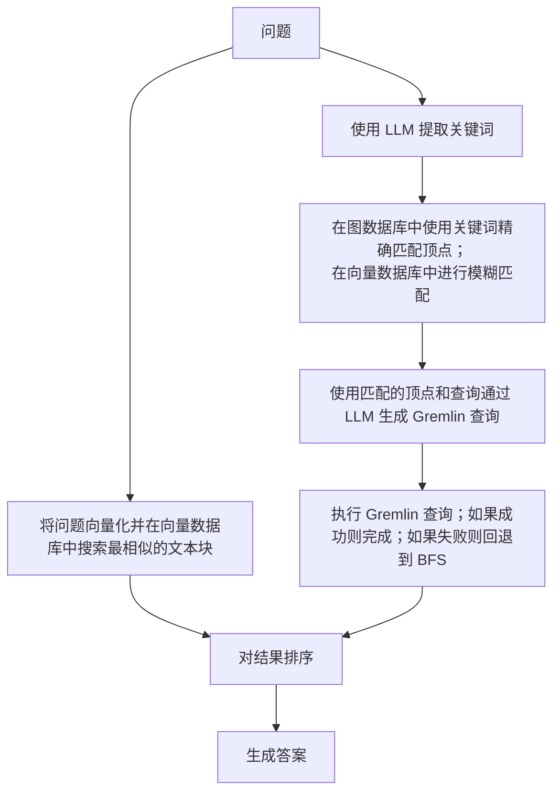
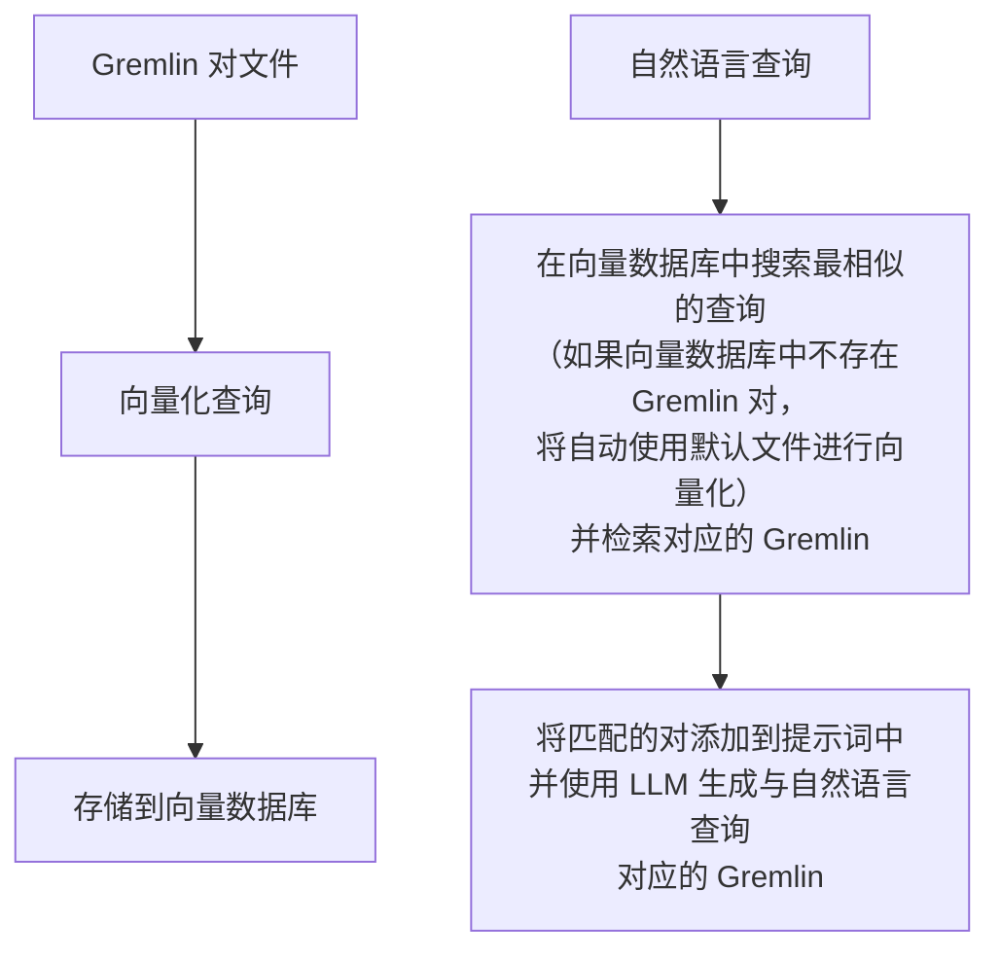

> 请参考[主文档](./_index.md)了解基本 UI 功能及详细信息，欢迎随时更新和改进，谢谢

# 1. 项目核心逻辑

## 构建 RAG 索引职责：

- 文本分割和向量化
- 从文本中提取图（构建知识图谱）并对顶点进行向量化

## (图)RAG 和用户功能职责：

- 基于查询从构建的知识图谱和向量数据库中检索相关内容，以补充提示词。

# 2. （处理流程）构建 RAG 索引

从文本构建知识图谱、文本块向量和图顶点向量。

### 四个输入字段：

- **文档：** 输入文本
- **Schema：** 图的 schema，可以以 JSON 格式的 schema 提供，或提供图名称（如果数据库中已存在）。
- **图提取提示词头部：** 提示词的头部
- **输出：** 显示结果

### 按钮：

- **获取 RAG 信息**
  - **获取向量索引信息：** 检索向量索引信息
  - **获取图索引信息：** 检索图索引信息

- **清除 RAG 数据**
  - **清除文本块向量索引：** 清除文本块向量
  - **清除图顶点向量索引：** 清除图顶点向量
  - **清除图数据：** 清除图数据

- **导入到向量：** 将文档中的文本转换为向量（需要先对文本进行分块，然后将分块转换为向量）
- **提取图数据 (1)：** 基于 Schema 从文档中提取图数据，使用图提取提示词头部和分块内容作为提示词
- **加载到图数据库 (2)：** 将提取的图数据存储到数据库（自动调用更新顶点向量以将向量存储到向量数据库）
- **更新顶点向量：** 将图顶点转换为向量

### 执行流程：

1. 在**文档**字段中输入文本。
2. 点击**导入到向量**按钮，对文本进行分割和向量化，存储到向量数据库。
3. 在 Schema 字段中输入图的 **Schema**。
4. 点击**提取图数据 (1)**按钮，将文本提取为图。
5. 点击**加载到图数据库 (2)**按钮，将提取的图存储到图数据库（这会自动调用**更新顶点向量**以将向量存储到向量数据库）。
6. 点击**更新顶点向量**按钮，将图顶点向量化并存储到向量数据库。

# 3. （处理流程）(图)RAG 和用户功能

前一个模块中的**导入到向量**按钮将文本（分块）转换为向量，**更新顶点向量**按钮将图顶点转换为向量。这些向量分别存储，用于在本模块中补充查询（答案生成）的上下文。换句话说，前一个模块为 RAG 准备数据（向量化），而本模块执行 RAG。

本模块包含两个部分：

- **HugeGraph RAG 查询**
- **（批量）回测**

第一部分处理单个查询，第二部分处理多个查询。以下是第一部分的说明。

### 输入字段：

- **问题：** 输入查询
- **查询提示词：** 用于向 LLM 提出最终问题的提示词模板
- **关键词提取提示词：** 用于从问题中提取关键词的提示词模板
- **模板数量：** < 0 表示禁用 text2gql；= 0 表示不使用模板（零样本）；> 0 表示使用指定数量的模板

### 查询范围选择：

- **基础 LLM 答案：** 不使用 RAG 功能
- **仅向量答案：** 仅使用基于向量的检索（在向量数据库中查询文本块向量）
- **仅图答案：** 仅使用基于图的检索（在向量数据库中查询图顶点向量和图数据库）
- **图-向量答案：** 同时使用基于图和基于向量的检索

### 执行流程：

#### **仅图答案：**

- 使用**关键词提取提示词**从**问题**中提取关键词。

- 使用提取的关键词：
  - 首先，在图数据库中进行精确匹配。
  - 如果未找到匹配，在向量数据库（图顶点向量）中进行模糊匹配以检索相关顶点。

- **text2gql：** 调用 text2gql 相关接口，使用匹配的顶点作为实体，将**问题**转换为 Gremlin 查询并在图数据库中执行。

- **BFS：** 如果 text2gql 失败（LLM 生成的查询可能无效），则回退到使用预定义的**Gremlin 查询模板**执行图查询（本质上是 BFS 遍历）。

#### **仅向量答案：**

- 将**查询**转换为向量。
- 在向量数据库的**文本块向量**数据集中搜索最相似的内容。

#### **排序和答案生成：**

- 执行检索后，对搜索结果进行排序以构建最终的**提示词**。
- 基于不同的提示词配置生成答案，并在不同的输出字段中显示：
  - **基础 LLM 答案**
  - **仅向量答案**
  - **仅图答案**
  - **图-向量答案**

# 4. （处理流程）Text2Gremlin

将自然语言查询转换为 Gremlin 查询。

本模块包含两个部分：

- **构建向量模板索引（可选）：** 将示例文件中的查询/gremlin 对进行向量化并存储到向量数据库中，用于生成 Gremlin 查询时参考。
- **自然语言转 Gremlin：** 将自然语言查询转换为 Gremlin 查询。

第一部分较为简单，因此重点介绍第二部分。

### 第二部分的输入字段：

- **自然语言查询：** 输入要转换为 Gremlin 的自然语言文本。

- **Schema：** 输入图的 schema。

### 执行流程：

1. 在**自然语言查询**字段中输入**查询**（自然语言）。
2. 在**Schema**字段中输入**图 schema**。
3. 点击**Text2Gremlin**按钮，执行以下逻辑：
   1. 将**查询**转换为向量。
   2. 构建**提示词**：
      - 检索**图 schema**。
      - 在向量数据库中查询示例向量，检索与输入查询相似的查询-gremlin 对（如果向量数据库中缺少示例，将自动使用**resources**文件夹中的示例进行初始化）。

      - 使用构建的提示词生成 Gremlin 查询。

# 5. 图工具

输入 Gremlin 查询以执行相应操作。
