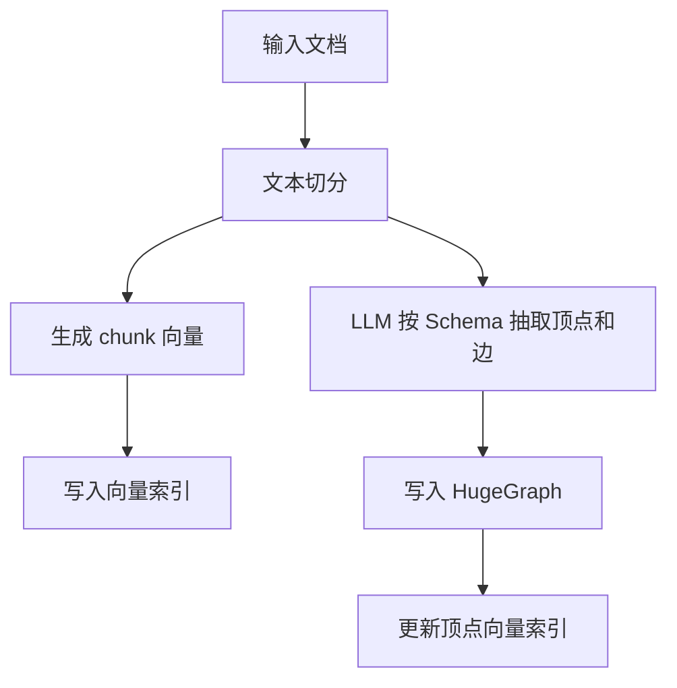
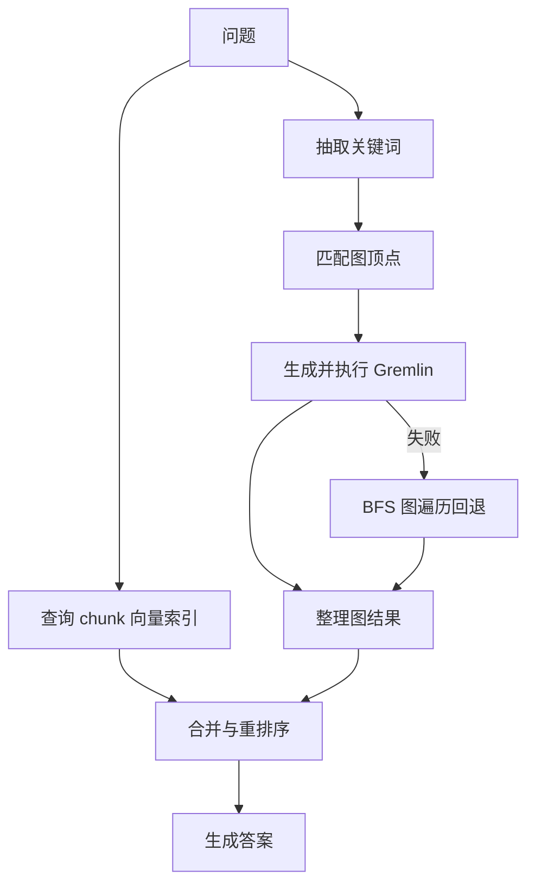

本文说明 HugeGraph-LLM Web 页面的处理流程。服务启动方式见 [HugeGraph-LLM](./hugegraph-llm.md)。

## 0. 配置面板

标签页上方是可折叠的配置面板，共五个部分：`1. Set up the HugeGraph server.`、`2. Set up the LLM.`、`3. Set up the Embedding.`、`4. Set up the Reranker.` 和 `5. Set up the vector engine.`。每部分都有独立的应用按钮，应用后会把受支持的字段写回 `.env`。页面顶部还会显示当前提示词语言。

## 1. 构建 RAG 索引

第一个标签页负责两类索引：

- 将文档切分后写入 chunk 向量索引。
- 按 Schema 从文档抽取顶点和边，写入 HugeGraph，并维护顶点向量索引。


```mermaid
flowchart TD
    A[输入文档] --> B[文本切分]
    B --> C[生成 chunk 向量]
    C --> D[写入向量索引]
    B --> E[LLM 按 Schema 抽取顶点和边]
    E --> F[写入 HugeGraph]
    F --> G[更新顶点向量索引]
```

输入来自 `text` 子页或 `file` 子页。上传支持 `.txt`、`.docx` 和 `.pdf`，可一次选择多个文件。

页面包含文档、Schema、抽取提示词和结果区域。常用操作有：

1. `Import into Vector`：切分文档并建立 chunk 向量索引。
2. `Extract Graph Data (1)`：按 Schema 抽取图数据。
3. `Load into GraphDB (2)`：把抽取结果写入 HugeGraph，并自动更新顶点向量。
4. `Update Vid Embedding`：重新生成顶点向量，通常只在图中已有数据时才需要单独执行。

这些按钮旁的 `Graph Extraction Split Type` 下拉框可选 `document`、`paragraph` 或 `sentence`。`document` 把输入整体作为一个单元，另外两种会在抽取前先切分长文档。

页面还可以查看或清除 chunk 索引、顶点索引和图数据。清除操作会删除已有数据，执行前先确认当前图和索引是否仍被其他查询使用。

主控件下方还有两个折叠的辅助工具：

- `Graph Schema Generator`：根据查询示例和少样本示例生成 Schema，填入 Graph Schema 字段。
- `Graph Extraction Prompt Generator`：根据期望场景（例如社交关系、金融知识图谱）和选定的参考示例生成 Graph Extract Prompt Header。

## 2. GraphRAG 查询

第二个标签页提供四种回答范围：

- 直接使用 LLM 回答。
- 只使用 chunk 向量召回。
- 只使用图召回。
- 合并图召回与向量召回。


```mermaid
flowchart TD
    Q[问题] --> V[查询 chunk 向量索引]
    Q --> K[抽取关键词]
    K --> M[匹配图顶点]
    M --> T[生成并执行 Gremlin]
    T -->|失败| B[BFS 图遍历回退]
    T --> R[整理图结果]
    B --> R
    V --> S[合并与重排序]
    R --> S
    S --> A[生成答案]
```

图召回先用关键词精确匹配 HugeGraph 顶点，找不到时再用顶点向量做近似匹配。匹配结果会进入 Text2Gremlin；生成或执行失败时，流程可以回退到预定义的图遍历。

`Template Num` 控制 Text2Gremlin 在图召回中的参与方式：

- 小于 0：完全跳过 Text2Gremlin，图召回直接使用预定义的图遍历。
- 等于 0：不带任何示例生成 Gremlin（zero-shot）。
- 大于 0：从示例索引中取相应数量的相近示例，并采用带模板的生成结果。示例数量会被限制在 0 到 10 之间。

该标签页的其他控件还有 `Rerank method`（`bleu` 或 `reranker`）、`Graph Ratio`、`Near neighbor first` 和 `Query related information`，以及可编辑的 `Query Prompt` 和 `Keywords Extraction Prompt`。

单条问答面板下方是批量回归测试面板。上传 `.xlsx` 或 `.csv` 问题文件，设置 `Max Lines To Show`，点击 `Generate Answer (Batch)`。答案会显示在预览表格中，并可下载为文件。上传控件旁提供模板文件下载。

## 3. Text2Gremlin

第三个标签页分为两部分。上半部分用问题与 Gremlin 对照文件（`.json` 或 `.csv`）构建示例向量索引；未上传文件时使用内置的 `resources/demo/text2gremlin.csv`。

下半部分把自然语言转换成 Gremlin：

1. 读取当前图的 Schema。
2. 从示例向量索引取回相近的自然语言与 Gremlin 对。
3. 把问题、Schema、示例和已匹配顶点填入提示词。
4. 调用 LLM 生成 Gremlin，并按所选输出类型决定是否执行。

`Number of refer examples` 设置取回的示例数量，范围 0 到 10，默认 2。结果显示在四个字段中：带模板的 Gremlin、不带模板的 Gremlin，以及两者各自的执行输出。


自定义提示词必须包含 `{query}`、`{schema}`、`{example}` 和 `{vertices}`。缺少任一占位符时，REST API 会拒绝请求。

## 4. 图工具与管理工具

`Graph Tools` 标签页可直接对当前图执行 Gremlin 查询、手动触发图备份，并通过 beta 操作初始化 HugeGraph 演示数据。后台还有两个任务：每天 01:00 自动备份图数据，以及在进程运行期间持续更新顶点 id 向量。

`Admin Tools` 需要密码。输入已配置的 `ADMIN_TOKEN` 后可查看 `logs/llm-server.log` 的末尾内容（每 60 秒自动刷新），并可手动刷新或清空该文件。`ADMIN_TOKEN` 为空或仍是占位值 `xxxx` 时，访问会被拒绝。

设置 `ENABLE_LOGIN=True` 后，Web 页面会要求基础认证，用户名固定为 `rag`，密码是 `USER_TOKEN`；REST API 则要求把 `USER_TOKEN` 作为 Bearer token。日志接口还要求单独配置安全的 `ADMIN_TOKEN`。


## 5. 提示词语言

在 `hugegraph-llm/.env` 中设置：

```properties
# 英文提示词
LANGUAGE=EN

# 中文提示词
LANGUAGE=CN
```

修改后重启服务。该配置选择内置提示词语言，不会自动翻译输入文档，也不是 `/rag` 请求体字段。

## 6. REST 调用

Web 页面和 REST API 使用同一套流程。需要程序集成时使用 `/rag`、`/rag/graph`、`/graph/extract` 和 `/text2gremlin`；请求结构见 [REST API](./rest-api.md)。
