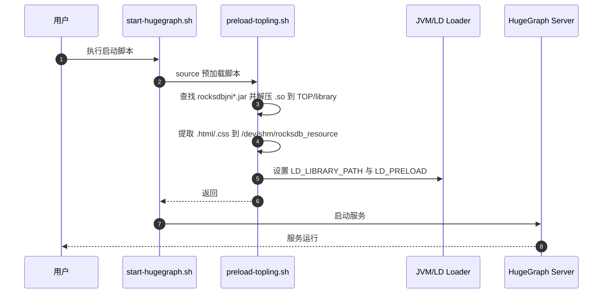
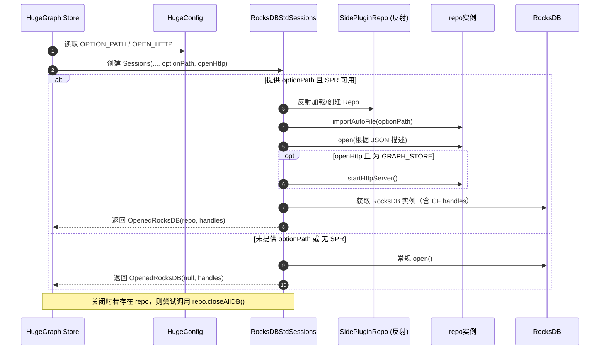
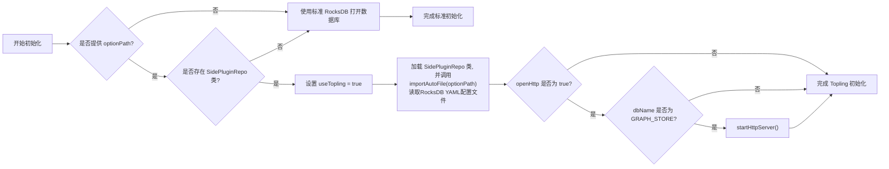

## 概述

HugeGraph RocksDB Plus旨在增加对ToplingDB的兼容, 为用户提供额外的存储引擎选择，在性能、功能和易用性各方面实现提升


## 设计目标

* **动态配置**: 支持通过 YAML 文件灵活配置 RocksDB 参数，替代硬编码方式，提升可维护性和适配性
* **兼容性强**: 保持与 RocksDB API 完全兼容，确保用户可无缝迁移或集成现有 RocksDB 代码和数据
* **可视化监控**: 提供 Web Server 接口，支持实时查看存储引擎运行状态和参数配置，增强可观测性
* **简化部署**: 自动加载 JAR 包中的动态库，无需手动设置 `LD_PRELOAD` 或执行复杂的启动流程，降低用户使用门槛


## 整体架构图

#### HugeGraph脚本启动逻辑

下图❷ ~ ❻是为了支持RocksDB Plus添加的预加载逻辑。

对于用户而言，启动依旧是执行start-hugegraph.sh，启动行为保持一致。




#### RocksDB Plus启动逻辑

通过反射检测是否包含RocksDB Plus API，如果包含，尝试使用RocksDB Plus API启动存储引擎；否则使用常规RocksDB API启动存储引擎。




## 涉及模块

### RocksDB Plus JAR包及Maven设置

两种方式获得JAR包:

1. 从Github仓库拉取
2. 自行打包并添加至Maven

#### 从Github仓库拉取JAR包

因为当前ToplingDB没有在Maven中央仓库发包，所以当前只能使用在Github上通过Github Actions发行的[JAR包](https://github.com/hugegraph/toplingdb/packages/2550860)

在Maven的`settings.xml`中新增GitHub 仓库配置

```xml
<repository>
    <id>github</id>
    <url>https://maven.pkg.github.com/hugegraph/toplingdb</url>
    <snapshots>
        <enabled>true</enabled>
    </snapshots>
</repository>
```

同时，`hugegraph-server/hugegraph-rocksdb/pom.xml`中rocksdbjni的版本号由7.2.2修改至8.10.2-SNAPSHOT,以对应Github仓库中的版本号。

```xml
<dependency>
    <groupId>org.rocksdb</groupId>
    <artifactId>rocksdbjni</artifactId>
    <version>8.10.2-SNAPSHOT</version>
</dependency>
```


#### 自行生成RocksDB Plus JAR包

拉取[ToplingDB](https://github.com/topling/toplingdb)代码后，在代码目录下执行：

```Shell
#编译共享库
make -j`nproc` DEBUG_LEVEL=0 shared_lib
#安装共享库
sudo make install-shared PREFIX=/opt DEBUG_LEVEL=0
#打包Jar包
make rocksdbjava -j`nproc` DEBUG_LEVEL=0 STRIP_DEBUG_INFO=1 ROCKSDB_JAR_WITH_DYNAMIC_LIBS=1

# 设定JAVA_HOME, 特别是要为root设置
export JAVA_HOME=/usr/lib/jvm/jre-openjdk-yourpath
# 安装 librocksdbjni 动态库
sudo make -j install-jni PREFIX=/opt DEBUG_LEVEL=0 STRIP_DEBUG_INFO=1
#Jar包安装至Maven本地仓库
cd java/target
cp rocksdbjni-8.10.2-linux64.jar rocksdbjni-8.10.2-SNAPSHOT-linux64.jar
mvn install:install-file -Dfile=rocksdbjni-8.10.2-SNAPSHOT-linux64.jar \
    -DgroupId=org.rocksdb -DartifactId=rocksdbjni \
    -Dversion=8.10.2-SNAPSHOT -Dpackaging=jar
```


### 动态库与静态资源预加载

ToplingDB使用了线程局部存储（TLS），需要使用LD_PRELOAD对动态库进行预加载。

同时，Web Server 也需要相关静态资源以渲染可视化界面。

因此，增加了`preload-topling.sh`脚本，用于预加载ToplingDB动态库和Web Server所需静态资源。

`preload-topling.sh`主要完成以下任务：

- 从 `rocksdbjni*.jar` 中提取 `.so` 动态库和 Web 可视化资源（HTML/CSS）
- 设置 `LD_LIBRARY_PATH` 和 `LD_PRELOAD` 环境变量
- 处理 Ubuntu 24.04+ 的 `libaio` 兼容性问题

`init-hugegraph.sh`和`start-hugegraph`添加了对`preload-topling.sh`的调用，用户可忽略预加载细节。


### HugeGraph对RocksDB的配置项

在`hugegraph.properties`中新增 RocksDB Plus 配置文件路径（`option_path`）和是否启用 Web Server（`open_http`）的配置项。

```
# rocksdb backend config
#rocksdb.data_path=/path/to/disk
#rocksdb.wal_path=/path/to/disk
#rocksdb.option_path=./conf/graphs/rocksdb_plus.yaml
#rocksdb.open_http=true
```

在Java中解析类型和默认配置：

```java
public static final ConfigOption<String> OPTION_PATH =
        new ConfigOption<>(
                "rocksdb.option_path",
                "The YAML file for configuring Topling/RocksDB parameters",
                null,
                ""
        );    

public static final ConfigOption<Boolean> OPEN_HTTP =
        new ConfigOption<>(
                "rocksdb.open_http",
                "Whether to start Topling's HTTP service",
                disallowEmpty(),
                false
        );
```


### RocksDB Plus启动逻辑

当用户配置了 `option_path` 且 JAR 包中包含 RocksDB Plus API 时，将会读取配置文件进行RocksDB Plus的启动，否则回退至标准RocksDB启动。

为了保持配置端口的简洁，仅对存储图数据的数据库实例（`GRAPH_STORE`）开启Web Server。




## 设计决策和理由


1. **为什么只启动GRAPH_STORE的Web Server？**
   - 图数据均存储在GRAPH_STORE，性能调优和观测主要集中在这个数据库实例中

