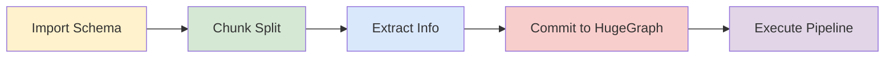
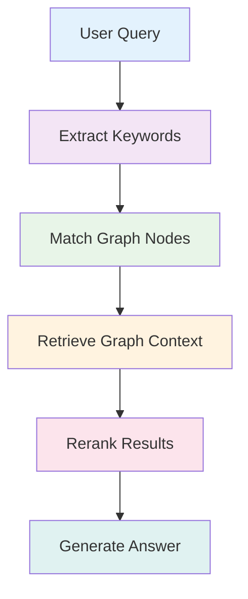

> Please refer to the AI repository [README](https://github.com/apache/incubator-hugegraph-ai/tree/main/hugegraph-llm#readme) for the most up-to-date documentation, and the official website **regularly** is updated and synchronized.

> **Bridge the gap between Graph Databases and Large Language Models**

> AI summarizes the project documentation: [](https://deepwiki.com/apache/incubator-hugegraph-ai)


## 🎯 Overview

HugeGraph-LLM is a comprehensive toolkit that combines the power of graph databases with large language models.
It enables seamless integration between HugeGraph and LLMs for building intelligent applications.

### Key Features
- 🏗️ **Knowledge Graph Construction** - Build KGs automatically using LLMs + HugeGraph
- 🗣️ **Natural Language Querying** - Operate graph databases using natural language (Gremlin/Cypher)
- 🔍 **Graph-Enhanced RAG** - Leverage knowledge graphs to improve answer accuracy (GraphRAG & Graph Agent)

For detailed source code doc, visit our [DeepWiki](https://deepwiki.com/apache/incubator-hugegraph-ai) page. (Recommended)

## 📋 Prerequisites

> [!IMPORTANT]
> - **Python**: 3.10+ (not tested on 3.12)
> - **HugeGraph Server**: 1.3+ (recommended: 1.5+)
> - **UV Package Manager**: 0.7+

## 🚀 Quick Start

Choose your preferred deployment method:

### Option 1: Docker Compose (Recommended)

The fastest way to get started with both HugeGraph Server and RAG Service:

```bash
# 1. Set up environment
cp docker/env.template docker/.env
# Edit docker/.env and set PROJECT_PATH to your actual project path

# 2. Deploy services
cd docker
docker-compose -f docker-compose-network.yml up -d

# 3. Verify deployment
docker-compose -f docker-compose-network.yml ps

# 4. Access services
# HugeGraph Server: http://localhost:8080
# RAG Service: http://localhost:8001
```

### Option 2: Individual Docker Containers

For more control over individual components:

#### Available Images
- **`hugegraph/rag`** - Development image with source code access
- **`hugegraph/rag-bin`** - Production-optimized binary (compiled with Nuitka)

```bash
# 1. Create network
docker network create -d bridge hugegraph-net

# 2. Start HugeGraph Server
docker run -itd --name=server -p 8080:8080 --network hugegraph-net hugegraph/hugegraph

# 3. Start RAG Service
docker pull hugegraph/rag:latest
docker run -itd --name rag \
  -v /path/to/your/hugegraph-llm/.env:/home/work/hugegraph-llm/.env \
  -p 8001:8001 --network hugegraph-net hugegraph/rag

# 4. Monitor logs
docker logs -f rag
```

### Option 3: Build from Source

For development and customization:

```bash
# 1. Start HugeGraph Server
docker run -itd --name=server -p 8080:8080 hugegraph/hugegraph

# 2. Install UV package manager
curl -LsSf https://astral.sh/uv/install.sh | sh

# 3. Clone and setup project
git clone https://github.com/apache/incubator-hugegraph-ai.git
cd incubator-hugegraph-ai/hugegraph-llm

# 4. Create virtual environment and install dependencies
uv venv && source .venv/bin/activate
uv pip install -e .

# 5. Launch RAG demo
python -m hugegraph_llm.demo.rag_demo.app
# Access at: http://127.0.0.1:8001

# 6. (Optional) Custom host/port
python -m hugegraph_llm.demo.rag_demo.app --host 127.0.0.1 --port 18001
```

#### Additional Setup (Optional)

```bash
# Download NLTK stopwords for better text processing
python ./hugegraph_llm/operators/common_op/nltk_helper.py

# Update configuration files
python -m hugegraph_llm.config.generate --update
```

> [!TIP]
> Check our [Quick Start Guide](https://github.com/apache/incubator-hugegraph-ai/blob/main/hugegraph-llm/quick_start.md) for detailed usage examples and query logic explanations.

## 💡 Usage Examples

### Knowledge Graph Construction

#### Interactive Web Interface

Use the Gradio interface for visual knowledge graph building:

**Input Options:**
- **Text**: Direct text input for RAG index creation
- **Files**: Upload TXT or DOCX files (multiple selection supported)

**Schema Configuration:**
- **Custom Schema**: JSON format following our [template](https://github.com/apache/incubator-hugegraph-ai/blob/aff3bbe25fa91c3414947a196131be812c20ef11/hugegraph-llm/src/hugegraph_llm/config/config_data.py#L125)
- **HugeGraph Schema**: Use existing graph instance schema (e.g., "hugegraph")


#### Programmatic Construction

Build knowledge graphs with code using the `KgBuilder` class:

```python
from hugegraph_llm.models.llms.init_llm import LLMs
from hugegraph_llm.operators.kg_construction_task import KgBuilder

# Initialize and chain operations
TEXT = "Your input text here..."
builder = KgBuilder(LLMs().get_chat_llm())

(
    builder
    .import_schema(from_hugegraph="talent_graph").print_result()
    .chunk_split(TEXT).print_result()
    .extract_info(extract_type="property_graph").print_result()
    .commit_to_hugegraph()
    .run()
)
```

**Pipeline Workflow:**


### Graph-Enhanced RAG

Leverage HugeGraph for retrieval-augmented generation:

```python
from hugegraph_llm.operators.graph_rag_task import RAGPipeline

# Initialize RAG pipeline
graph_rag = RAGPipeline()

# Execute RAG workflow
(
    graph_rag
    .extract_keywords(text="Tell me about Al Pacino.")
    .keywords_to_vid()
    .query_graphdb(max_deep=2, max_graph_items=30)
    .merge_dedup_rerank()
    .synthesize_answer(vector_only_answer=False, graph_only_answer=True)
    .run(verbose=True)
)
```

**RAG Pipeline Flow:**


## 🔧 Configuration

After running the demo, configuration files are automatically generated:

- **Environment**: `hugegraph-llm/.env`
- **Prompts**: `hugegraph-llm/src/hugegraph_llm/resources/demo/config_prompt.yaml`

> [!NOTE]
> Configuration changes are automatically saved when using the web interface. For manual changes, simply refresh the page to load updates.

**LLM Provider Support**: This project uses [LiteLLM](https://docs.litellm.ai/docs/providers) for multi-provider LLM support.

## 📚 Additional Resources

- **Graph Visualization**: Use [HugeGraph Hubble](https://hub.docker.com/r/hugegraph/hubble) for data analysis and schema management
- **API Documentation**: Explore our REST API endpoints for integration
- **Community**: Join our discussions and contribute to the project

---

**License**: Apache License 2.0 | **Community**: [Apache HugeGraph](https://hugegraph.apache.org/)
