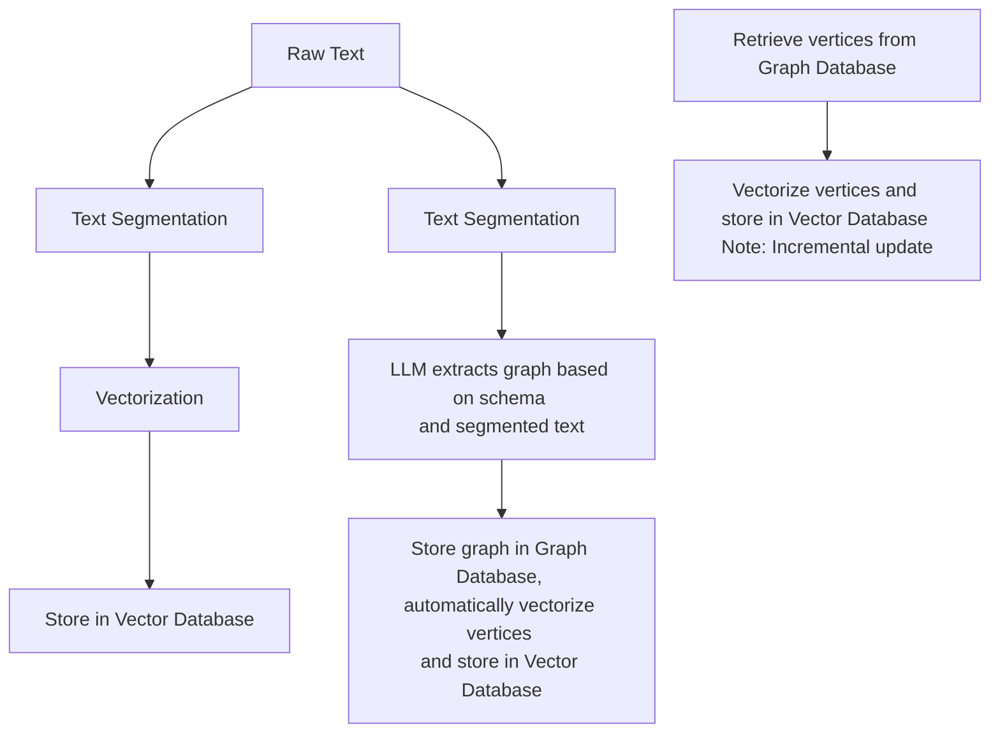
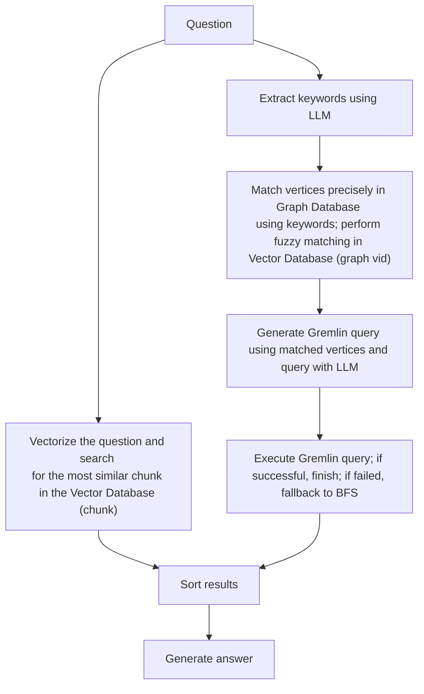
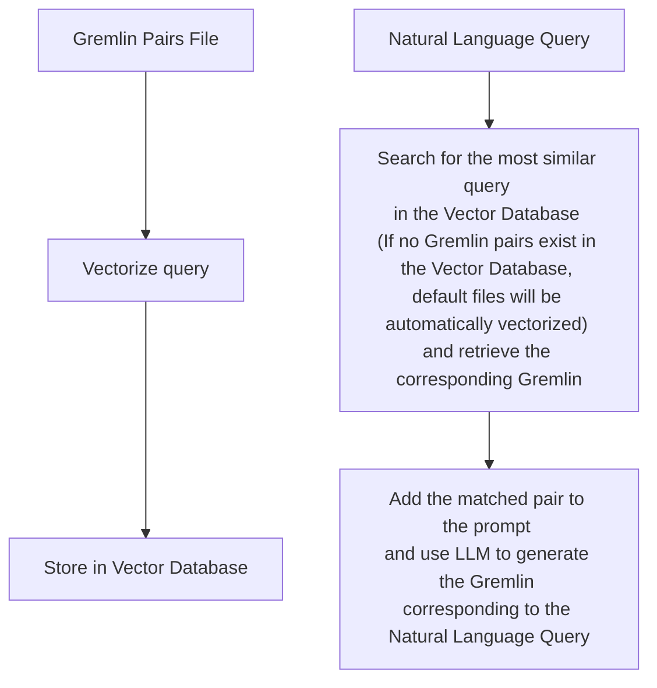

> Follow up [main doc](../) to introduce the basic UI function & details, welcome to update and improve at any time, thanks

# 1. Core Logic of the Project

## Build RAG Index Responsibilities:

- Split and vectorize text
- Extract text into a graph (construct a knowledge graph) and vectorize the vertices

## (Graph)RAG & User Functions Responsibilities:

- Retrieve relevant content from the constructed knowledge graph and vector database based on the query to supplement the prompt.

# 2. (Processing Flow) Build RAG Index

Construct a knowledge graph, chunk vector, and graph vid vector from the text.

### Four Input Fields:

- **Doc(s):** Input text
- **Schema:** The schema of the graph, which can be provided as a JSON-formatted schema or as the graph name (if it exists in the database).
- **Graph** **Extract Prompt Header:** The header of the prompt
- **Output**: Display results

### Buttons:

- **Get RAG Info**

  - **Get Vector Index Info:** Retrieve vector index information

  - **Get** **Graph** **Index Info:** Retrieve graph index information

- **Clear RAG Data**
  - **Clear Chunks Vector Index:** Clear chunk vector
  - **Clear Graph Vid Vector Index**: Clear graph vid vector
  - **Clear Graph Data**: Clear Graph Data
- **Import into** **Vector**: Convert the text in Doc(s) into vectors (requires chunking the text first and then converting the chunks into vectors)
- **Extract** **Graph** **Data (1):** Extract graph data from Doc(s) based on the Schema, using the Graph Extract Prompt Header and chunked content as the prompt
- **Load into GraphDB (2):** Store the extracted graph data into the database (automatically calls Update Vid Embedding to store vectors in the vector database)
- **Update Vid Embedding:** Convert graph vid into vectors

### Execution Flow:

1. Input text into the **Doc(s)** field.
2. Click the **Import into** **Vector** button to split and vectorize the text, storing it in the vector database.
3. Input the graph **Schema** into the Schema field.
4. Click the **Extract** **Graph** **Data (1)** button to extract the text into a graph.
5. Click the **Load into GraphDB (2)** button to store the extracted graph into the graph database (this automatically calls **Update Vid Embedding** to store the vectors in the vector database).
6. Click the **Update** **Vid** **Embedding** button to vectorize the graph vertices and store them in the vector database.

# 3. (Processing Flow) (Graph)RAG & User Functions

The **Import into** **Vector** button in the previous module converts text (chunks) into vectors, and the **Update Vid Embedding** button converts graph vid into vectors. These vectors are stored separately to supplement the context for queries (answer generation) in this module. In other words, the previous module prepares the data for RAG (vectorization), while this module executes RAG.

This module consists of two parts:

- **HugeGraph RAG** **Query**
- **(Batch) Back-testing**

The first part handles single queries, while the second part handles multiple queries at once. Below is an explanation of the first part.

### Input Fields:

- **Question:** Input the query
- **Query** **Prompt:** The prompt template used to ask the final question to the LLM
- **Keywords Extraction Prompt:** The prompt template for extracting keywords from the question
- **Template Num:** < 0 means disable text2gql; = 0 means no template(zero-shot); > 0 means using the specified number of templates

### Query Scope Selection:

- **Basic** **LLM** **Answer:** Does not use RAG functionality
- **Vector-only Answer:** Uses only vector-based retrieval (queries chunk vectors in the vector database)
- **Graph-only Answer:** Uses only graph-based retrieval (queries graph vid vectors in the vector database and the graph database)
- **Graph-Vector Answer:** Uses both graph-based and vector-based retrieval

### Execution Flow:

#### **Graph-only Answer:**

- Extract keywords from the **question** using the **Keywords Extraction Prompt**.

- Use the extracted keywords to:

  - First, perform an exact match in the graph database.

  - If no match is found, perform a fuzzy match in the vector database (graph vid vector) to retrieve relevant vertices.

- **text2gql:** Call the text2gql-related interface, using the matched vertices as entities to convert the **question** into a Gremlin query and execute it in the graph database.

- **BFS:** If text2gql fails (LLM-generated queries might be invalid), fall back to executing a graph query using a predefined **Gremlin query template** (essentially a BFS traversal).

#### **Vector-only Answer:**

- Convert the **query** into a vector.

- Search for the most similar content in the **chunk vector** dataset in the vector database.

#### **Sorting and Answer Generation:**

- After executing the retrieval, sort the search (retrieval) results to construct the final **prompt**.

- Generate answers based on different prompt configurations and display them in different output fields:
  - **Basic** **LLM** **Answer**
  - **Vector-only Answer**
  - **Graph-only Answer**
  - **Graph-Vector Answer**

# 4. (Processing Flow) Text2Gremlin

Converts natural language queries into Gremlin queries.

This module consists of two parts:

- **Build** **Vector** **Template Index (Optional):** Vectorizes query/gremlin pairs from sample files and stores them in the vector database for reference when generating Gremlin queries.
- **Natural Language to Gremlin:** Converts natural language queries into Gremlin queries.

The first part is straightforward, so the focus is on the second part.

### Input Fields for the Second Part:

- **Natural Language** **Query**: Input the natural language text to be converted into Gremlin.

- **Schema:** Input the graph schema.

### Execution Flow:

1. Input the **query** (natural language) into the **Natural Language Query** field.

2. Input the **graph** **schema** into the **Schema** field.

3. Click the **Text2Gremlin** button, and the following execution logic applies:

   1. Convert the **query** into a vector.

   2. Construct the **prompt**:

      - Retrieve the **graph schema**.
      - Query the vector database for example vectors, retrieving query-gremlin pairs similar to the input query (if the vector database lacks examples, it automatically initializes with examples from the **resources** folder).

      - Generate the Gremlin query using the constructed prompt.

# 5. Graph Tools

Input Gremlin queries to execute corresponding operations.
