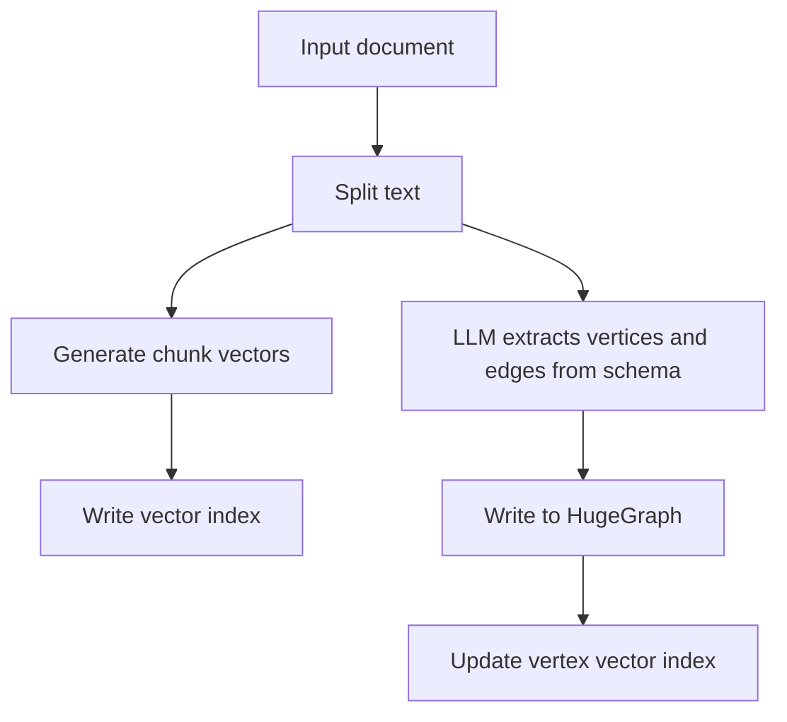
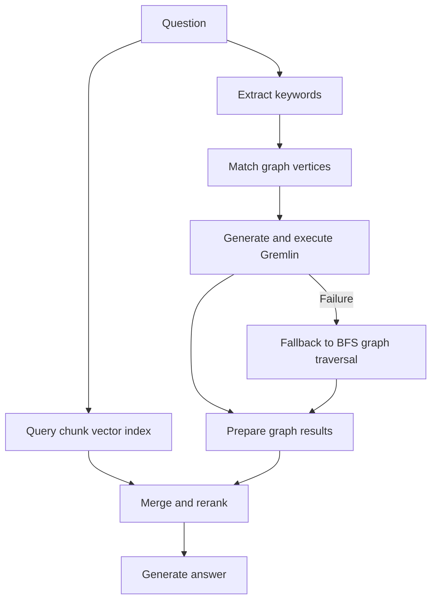

This page explains the processing flow in the HugeGraph-LLM Web UI. See [HugeGraph-LLM](./hugegraph-llm.md) for startup instructions.

## 0. Configuration Panel

Above the tabs sits a collapsible configuration panel with five sections: `1. Set up the HugeGraph server.`, `2. Set up the LLM.`, `3. Set up the Embedding.`, `4. Set up the Reranker.`, and `5. Set up the vector engine.`. Each section has its own apply button, and applying a change writes the supported fields back to `.env`. The header also shows the current prompt language.

## 1. Build RAG Indexes

The first tab splits documents into a chunk vector index. It also extracts vertices and edges according to a schema, writes them to HugeGraph, and maintains a vertex vector index.

```mermaid
flowchart TD
    A[Input document] --> B[Split text]
    B --> C[Generate chunk vectors]
    C --> D[Write vector index]
    B --> E[LLM extracts vertices and edges from schema]
    E --> F[Write to HugeGraph]
    F --> G[Update vertex vector index]
```

Input comes from either the `text` sub-tab or the `file` sub-tab. Uploads accept `.txt`, `.docx`, and `.pdf`, and several files can be selected at once.

Common operations are `Import into Vector`, `Extract Graph Data (1)`, `Load into GraphDB (2)`, and `Update Vid Embedding`. `Load into GraphDB (2)` also refreshes the vertex vector index, so the separate `Update Vid Embedding` step is only needed when the graph already held data. The `Graph Extraction Split Type` dropdown next to these buttons chooses `document`, `paragraph`, or `sentence`. `document` keeps the whole input as one unit; the other two split long documents before extraction.

The page can also inspect or clear chunk indexes, vertex indexes, and graph data. Clearing removes existing data, so first confirm that the current graph and indexes are not still used by other queries.

Two collapsed helpers sit below the main controls:

- `Graph Schema Generator` takes query examples and a few-shot example and produces a schema for the Graph Schema field.
- `Graph Extraction Prompt Generator` takes an expected scenario, such as social relationships or a financial knowledge graph, and a selected reference example, and produces a Graph Extract Prompt Header.

## 2. GraphRAG Queries

The second tab can answer directly with the LLM, use only chunk-vector retrieval, use only graph retrieval, or combine graph and vector retrieval.

```mermaid
flowchart TD
    Q[Question] --> V[Query chunk vector index]
    Q --> K[Extract keywords]
    K --> M[Match graph vertices]
    M --> T[Generate and execute Gremlin]
    T -->|Failure| B[Fallback to BFS graph traversal]
    T --> R[Prepare graph results]
    B --> R
    V --> S[Merge and rerank]
    R --> S
    S --> A[Generate answer]
```

Graph retrieval first matches HugeGraph vertices exactly by keyword and then uses vector similarity if no exact match exists. The matched vertices are passed to Text2Gremlin. If generation or execution fails, the pipeline can fall back to a predefined traversal.

`Template Num` controls how Text2Gremlin participates in graph retrieval:

- A negative value skips Text2Gremlin entirely, so graph retrieval goes straight to the predefined traversal.
- `0` generates Gremlin without any examples (zero-shot).
- A positive value retrieves that many similar examples from the example index and uses the template-guided result. The example count is clamped to the range 0 to 10.

Other controls on this tab are `Rerank method` (`bleu` or `reranker`), `Graph Ratio`, `Near neighbor first`, and `Query related information`, plus editable `Query Prompt` and `Keywords Extraction Prompt` fields.

Below the single-question panel is a batch back-testing panel. Upload an `.xlsx` or `.csv` file of questions, set `Max Lines To Show`, and click `Generate Answer (Batch)`. The answers appear in a preview table and can be downloaded as a file. A template file is offered next to the upload control.

## 3. Text2Gremlin

The third tab has two parts. The upper part builds the example vector index from a `.json` or `.csv` file of question and Gremlin pairs; the bundled `resources/demo/text2gremlin.csv` is used when no file is uploaded.

The lower part reads the graph schema, retrieves similar natural-language and Gremlin examples, fills the prompt with the question, schema, examples, and matched vertices, then generates Gremlin and optionally executes it. `Number of refer examples` sets how many examples are retrieved, from 0 to 10, and defaults to 2. The results appear in four fields: Gremlin with a template, Gremlin without a template, and the execution output for each.

A custom prompt must contain `{query}`, `{schema}`, `{example}`, and `{vertices}`. The REST API rejects a request if any placeholder is missing.

## 4. Graph and Administration Tools

`Graph Tools` runs a Gremlin query directly against the configured graph, triggers a manual graph backup, and can initialize demo data in HugeGraph through a beta action. A background job also backs up the graph every day at 01:00, and a second background task keeps vertex-id embeddings up to date while the process runs.

`Admin Tools` is password protected. Entering the configured `ADMIN_TOKEN` reveals the tail of `logs/llm-server.log`, which refreshes every 60 seconds, along with buttons to refresh or clear it. Access is refused while `ADMIN_TOKEN` is empty or still set to the placeholder `xxxx`.

When `ENABLE_LOGIN=True`, the Web UI asks for basic credentials with the fixed user name `rag` and `USER_TOKEN` as the password, and the REST API requires `USER_TOKEN` as a Bearer token. The log endpoint additionally requires a separately configured, secure `ADMIN_TOKEN`.

## 5. Prompt Language

Set `LANGUAGE=EN` or `LANGUAGE=CN` in `hugegraph-llm/.env`, then restart the service. This selects the language of built-in prompts; it does not translate input documents and is not a field in the `/rag` request body.

## 6. REST Calls

The Web UI and REST API use the same pipeline. For application integration, use `/rag`, `/rag/graph`, `/graph/extract`, and `/text2gremlin`; see the [REST API](./rest-api.md) for request formats.
