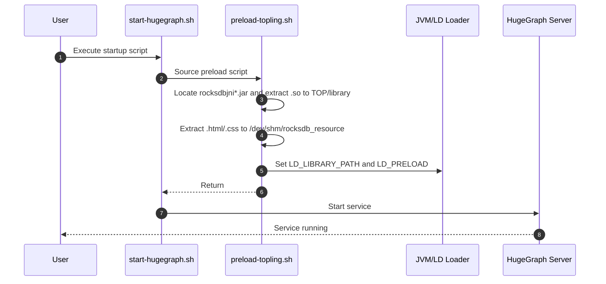
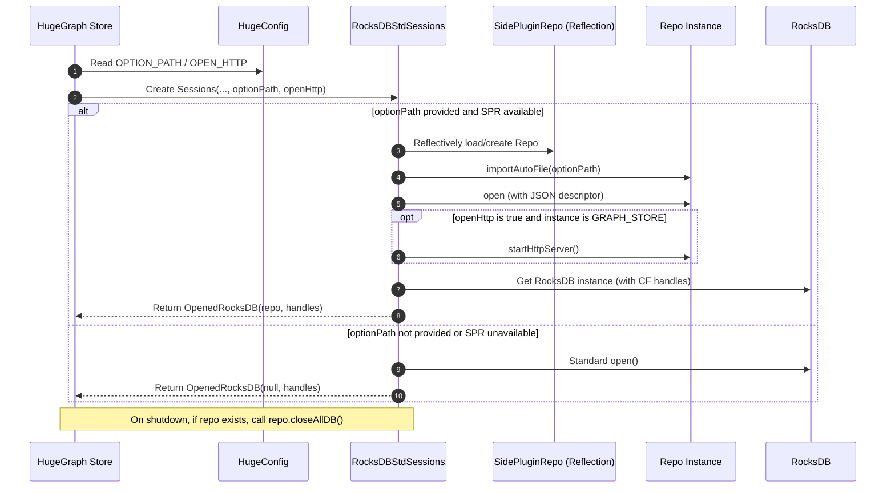
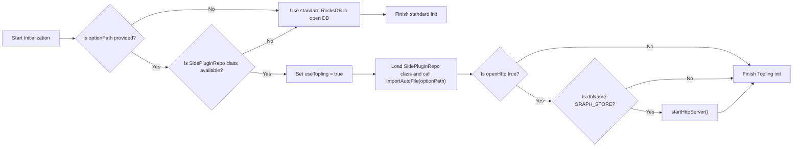

## Overview

HugeGraph RocksDB Plus aims to enhance compatibility with ToplingDB, providing users with an additional storage engine option that improves performance, functionality, and usability.

## Design Goals

* **Dynamic Configuration**: Support flexible configuration of RocksDB parameters via YAML files, replacing hardcoded values to improve maintainability and adaptability.
* **Strong Compatibility**: Maintain full compatibility with the RocksDB API, ensuring seamless migration and integration with existing RocksDB code and data.
* **Visual Monitoring**: Provide a Web Server interface for real-time visibility into storage engine status and configuration, enhancing observability.
* **Simplified Deployment**: Automatically load dynamic libraries from JAR packages without requiring manual `LD_PRELOAD` setup or complex startup procedures, lowering the barrier for users.

## Architecture Diagram

#### HugeGraph Startup Script Logic

Steps ❷ ~ ❻ in the diagram below illustrate the preload logic added to support RocksDB Plus.

From the user's perspective, startup remains unchanged—simply execute `start-hugegraph.sh`.



#### RocksDB Startup Logic

Use reflection to detect whether RocksDB Plus APIs are available. If present, attempt to start the storage engine using RocksDB Plus; otherwise, fall back to standard RocksDB APIs.



## Involved Modules

### RocksDB Plus JAR and Maven Setup

There are two ways to obtain the JAR package:

1. Pull from GitHub repository  
2. Build manually and install to Maven

#### Pull JAR from GitHub Repository

Since ToplingDB is not published to Maven Central, the JAR can only be obtained from GitHub Actions releases:  
[JAR Package](https://github.com/hugegraph/toplingdb/packages/2550860)

Add GitHub repository configuration to your Maven `settings.xml`:

```xml
<repository>
    <id>github</id>
    <url>https://maven.pkg.github.com/hugegraph/toplingdb</url>
    <snapshots>
        <enabled>true</enabled>
    </snapshots>
</repository>
```

Also, update the `rocksdbjni` version in `hugegraph-server/hugegraph-rocksdb/pom.xml` from `7.2.2` to `8.10.2-SNAPSHOT` to match the GitHub release:

```xml
<dependency>
    <groupId>org.rocksdb</groupId>
    <artifactId>rocksdbjni</artifactId>
    <version>8.10.2-SNAPSHOT</version>
</dependency>
```

#### Build RocksDB Plus JAR Manually

Clone [ToplingDB](https://github.com/topling/toplingdb) and run the following commands:

```bash
# Build shared library
make -j$(nproc) DEBUG_LEVEL=0 shared_lib
# Install shared library
sudo make install-shared PREFIX=/opt DEBUG_LEVEL=0
# Package JAR
make rocksdbjava -j$(nproc) DEBUG_LEVEL=0 STRIP_DEBUG_INFO=1 ROCKSDB_JAR_WITH_DYNAMIC_LIBS=1

# Set JAVA_HOME (especially for root)
export JAVA_HOME=/usr/lib/jvm/jre-openjdk-yourpath
# Install librocksdbjni dynamic library
sudo make -j install-jni PREFIX=/opt DEBUG_LEVEL=0 STRIP_DEBUG_INFO=1
# Install JAR to local Maven repository
cd java/target
cp rocksdbjni-8.10.2-linux64.jar rocksdbjni-8.10.2-SNAPSHOT-linux64.jar
mvn install:install-file -Dfile=rocksdbjni-8.10.2-SNAPSHOT-linux64.jar \
    -DgroupId=org.rocksdb -DartifactId=rocksdbjni \
    -Dversion=8.10.2-SNAPSHOT -Dpackaging=jar
```

### Preloading Dynamic Libraries and Static Resources

ToplingDB uses thread-local storage (TLS), requiring dynamic libraries to be preloaded via `LD_PRELOAD`.

Additionally, the Web Server needs static resources to render the visualization interface.

To support this, the `preload-topling.sh` script was added to preload ToplingDB dynamic libraries and Web Server resources.

Main tasks of `preload-topling.sh`:

- Extract `.so` libraries and Web resources (HTML/CSS) from `rocksdbjni*.jar`
- Set `LD_LIBRARY_PATH` and `LD_PRELOAD` environment variables
- Handle `libaio` compatibility issues on Ubuntu 24.04+

Both `init-hugegraph.sh` and `start-hugegraph.sh` now invoke `preload-topling.sh`, so users don’t need to worry about preload details.

### HugeGraph Configuration Options for RocksDB

Two new configuration options were added to `hugegraph.properties`: `option_path` for the YAML file and `open_http` to enable the Web Server.

```properties
# rocksdb backend config
#rocksdb.data_path=/path/to/disk
#rocksdb.wal_path=/path/to/disk
#rocksdb.option_path=./conf/graphs/rocksdb_plus.yaml
#rocksdb.open_http=true
```

Java-side parsing and default values:

```java
public static final ConfigOption<String> OPTION_PATH =
        new ConfigOption<>(
                "rocksdb.option_path",
                "The YAML file for configuring Topling/RocksDB parameters",
                null,
                ""
        );    

public static final ConfigOption<Boolean> OPEN_HTTP =
        new ConfigOption<>(
                "rocksdb.open_http",
                "Whether to start Topling's HTTP service",
                disallowEmpty(),
                false
        );
```

### RocksDB Plus Startup Logic

When `option_path` is configured and the JAR contains RocksDB Plus APIs, HugeGraph will load the YAML file and start RocksDB Plus. Otherwise, it falls back to standard RocksDB.

To keep port configuration simple, the Web Server is only enabled for the `GRAPH_STORE` instance.



## Design Decisions and Rationale

1. **Why is the Web Server only started for GRAPH_STORE?**  
   - All graph data is stored in GRAPH_STORE, and performance tuning and observability are primarily focused on this instance.